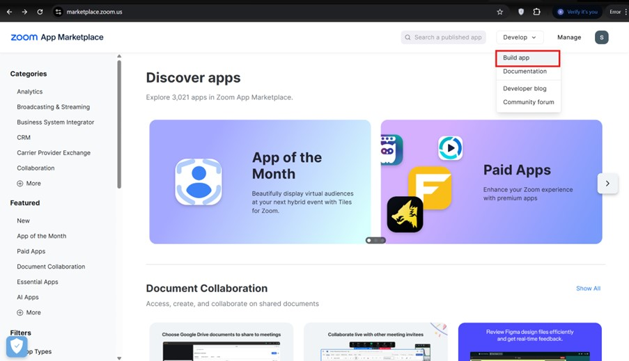
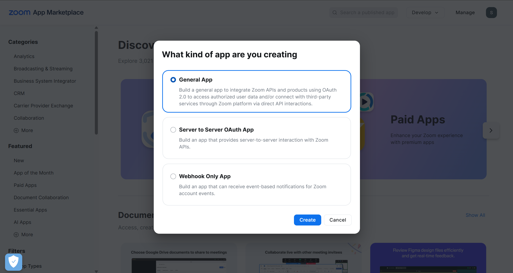
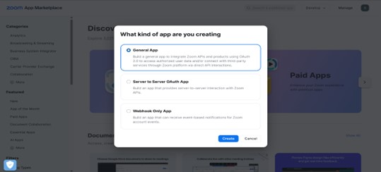
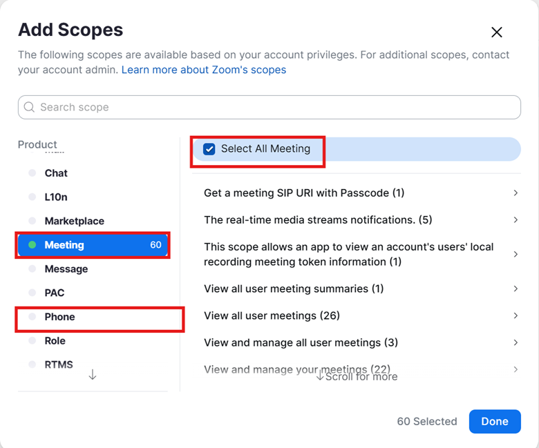
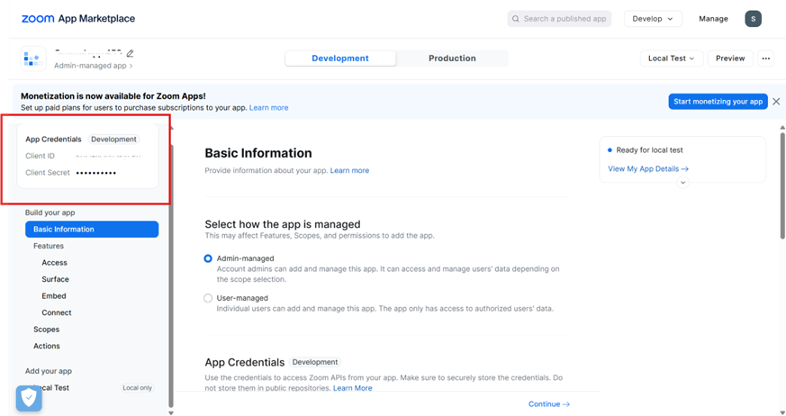
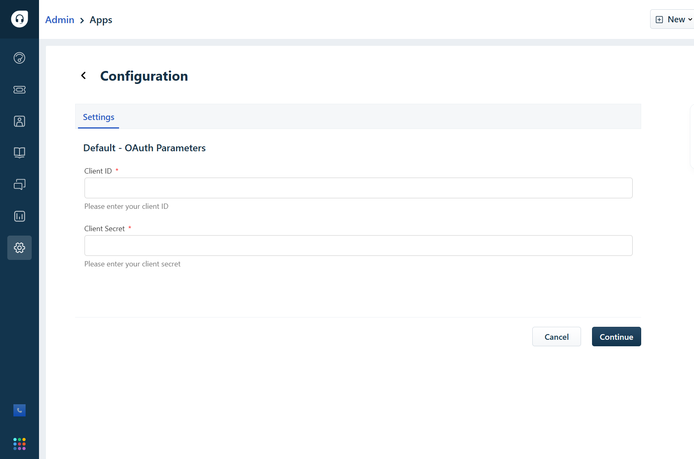
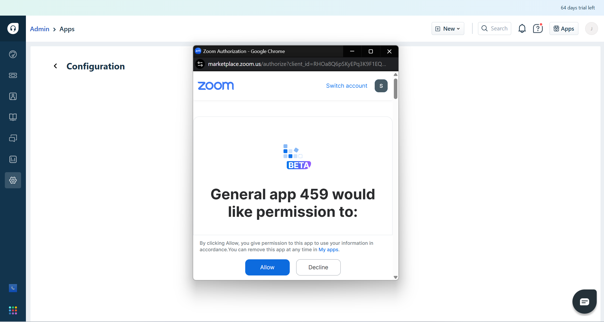

# Zoom OAuth Credentials Setup Guide

## Step 1: Sign In to Zoom Marketplace
- Go to [https://marketplace.zoom.us](https://marketplace.zoom.us)
- Log in using your Zoom account credentials.

## Step 2: Create a New App
1. Click on **Develop** (top-right menu) → select **Build App**.
2. From the list of available app types, choose **General App**.
3. Click **Create**.

<!-- 
 -->

  

<!-- 
 -->
<!--  -->

## Step 3: Configure App Management
- When asked **"How would you like your app to be managed?"**, select:
  - `Admin-managed`.

## Step 4: Set Redirect URL
- In the **OAuth Redirect URL**, enter:
https://oauth.freshdev.io/auth/callback

## Step 5: Add Scopes
- Navigate to the **Scopes** section.
- Under **Phone** and **Meeting**, click **Select All** to grant all necessary permissions.
- Click **Done** to confirm your scope selections.

## Step 6: Complete App Details
- Continue through the remaining steps to finalize the app setup.

## Step 7: Retrieve OAuth Credentials
- Once your app is created, find the **Client ID** and **Client Secret** in the **App Credentials** section on the left panel.

## Step 8: Enter Credentials in Your Application
- On the app installation page, input the retrieved:
- **Client ID**
- **Client Secret**

## Step 9: Authorize the App
- Click **Continue**.
- The Zoom Authorization screen will appear. Click **Allow** to grant permissions.
- Your OAuth integration will now be validated.

