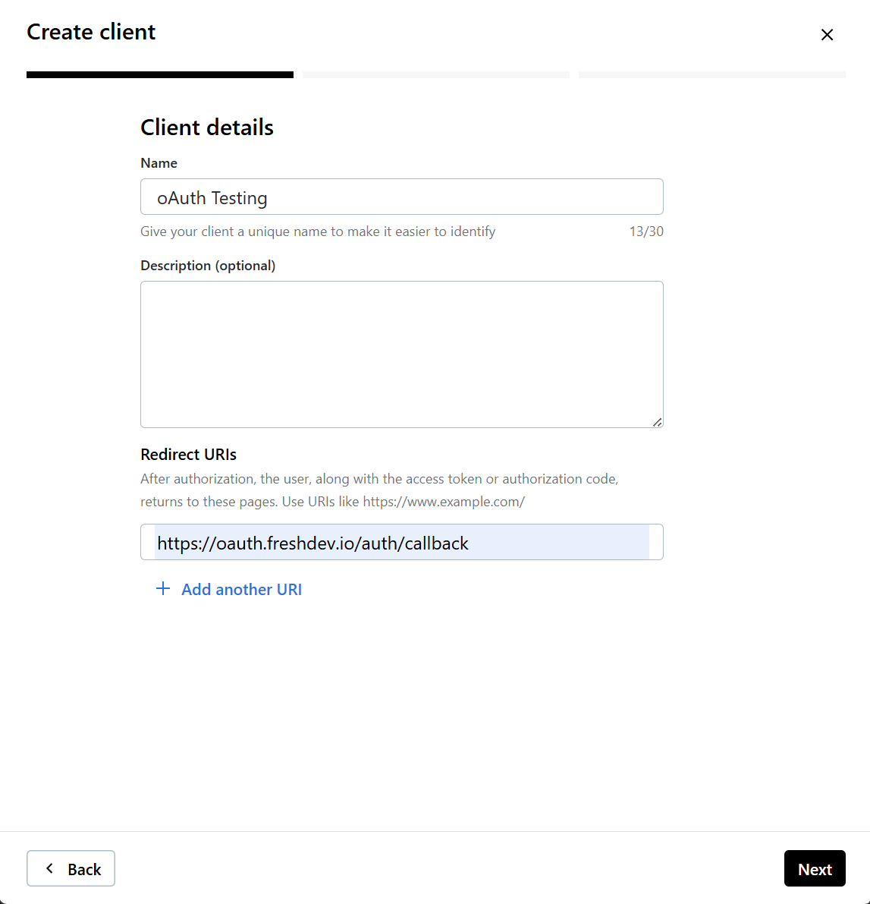
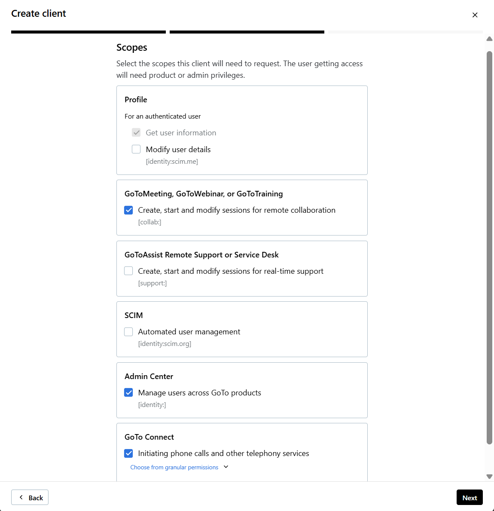
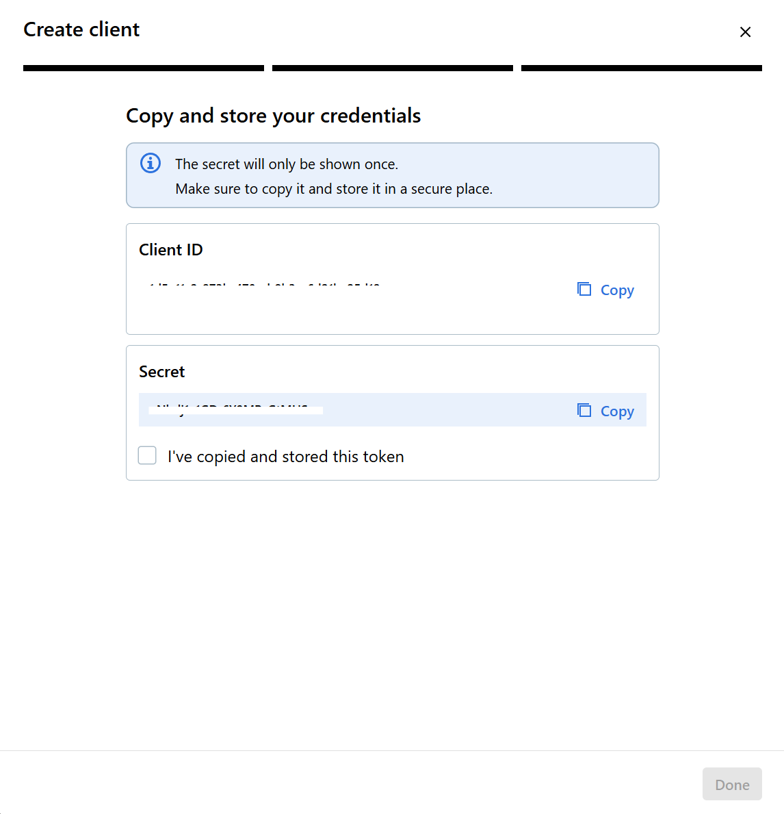
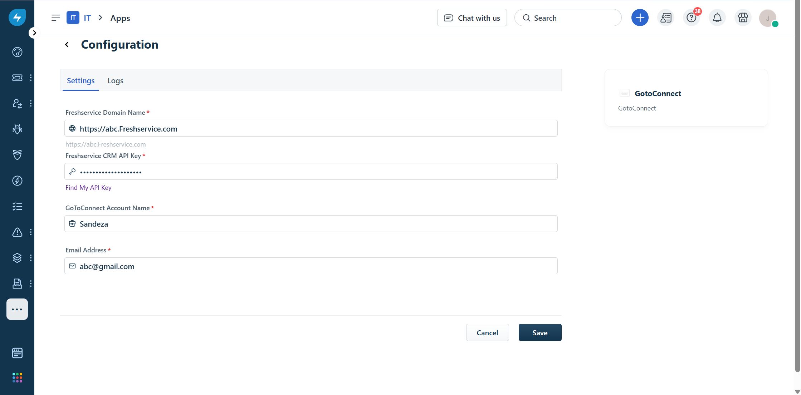
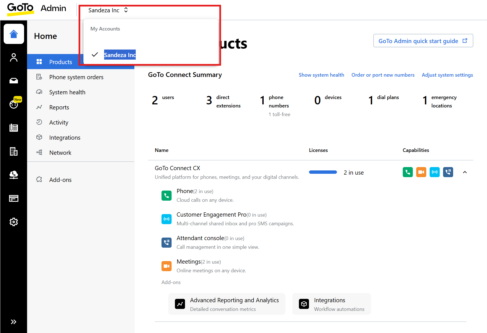

# GoTo OAuth Setup Guide   

## Step 1: Sign In to GoTo Developer Portal  
- Navigate to [https://developer.logmeininc.com/clients](https://developer.logmeininc.com/clients).  
- Log in using your **GoTo account credentials** (must have **Super Admin** access).  

---

## Step 2: Add a New Client  
1. Click **Add Client** (top-right).  
2. Fill in the **Client details**.  
3. In the **Redirect URI**, enter:  
https://oauth.freshdev.io/auth/callback

   

4. Under the **Scopes** section, select the following:  
- **GoToMeeting, GoToWebinar, or GoToTraining**  
- **Admin Center**  
- **GoTo Connect**  

    

---

## Step 3: Retrieve OAuth Credentials  
- The next screen displays your **Client ID** and **Client Secret**.  
- Copy and securely save these credentials for future use.   

  

---

# App Installation  

## 🎥 Watch Setup Tutorial  

  <iframe width="560" height="315"
    src="https://youtu.be/61gjShOCwBk"
    title="GoTo OAuth Setup Video"
    frameborder="0"
    allow="accelerometer; autoplay; clipboard-write; encrypted-media; gyroscope; picture-in-picture"
    allowfullscreen
    style="border-radius: 10px; box-shadow: 0 2px 8px rgba(0,0,0,0.2);">
  </iframe>

1. On the **App Installation** page, enter:  
- **Client ID**  
- **Client Secret**  

2. Click **Continue**.  
3. The **GoTo Authorization** screen will appear. Click **Allow** to grant permissions.  
4. Once authorized, the **App Installation** page will reappear.  

  

5. Enter the following details:  
- **Freshservice Domain Name**  
- **Freshservice API Key**  
6. Retrieve your **GoTo Account Name** from [https://admin.goto.com](https://admin.goto.com).  
  

7. Enter your **GoTo Account Name** and the **Email Address**.  
8. Click Install

✅ **Installation is now complete!**  
